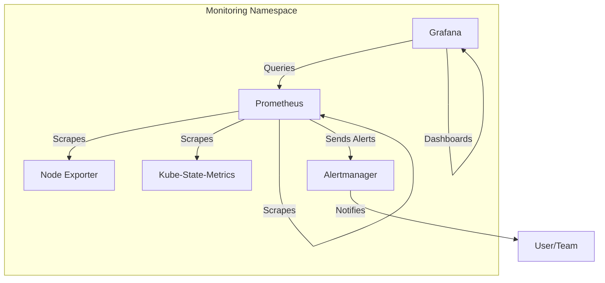

# Architecture Overview

## Components

### Prometheus
- Collects and stores metrics from Kubernetes components, Node Exporter, and Kube-State-Metrics.
- Evaluates alerting rules and sends alerts to Alertmanager.

### Grafana
- Visualizes metrics from Prometheus.
- Provides dashboards for cluster, node, and pod metrics.

### Alertmanager
- Receives alerts from Prometheus.
- Manages alert silencing, inhibition, and notification routing (e.g., email, PagerDuty).

### Node Exporter
- Runs as a DaemonSet on each node.
- Exposes hardware and OS metrics (CPU, memory, disk, network).

### Kube-State-Metrics
- Exposes Kubernetes object state metrics (deployments, pods, nodes, etc.).

## Data Flow
- Prometheus scrapes metrics from Node Exporter, Kube-State-Metrics, and itself.
- Grafana queries Prometheus for metrics and displays them in dashboards.
- Prometheus evaluates alerting rules and sends alerts to Alertmanager.
- Alertmanager routes alerts to notification channels (email, PagerDuty, etc.).

## Persistence
- Prometheus, Grafana, and Alertmanager use PersistentVolumeClaims in production for data durability.

## Security
- NetworkPolicies restrict access to monitoring components within the namespace.
- RBAC is used for least-privilege access.

---

> **Tip:** See the README for deployment and security best practices. 